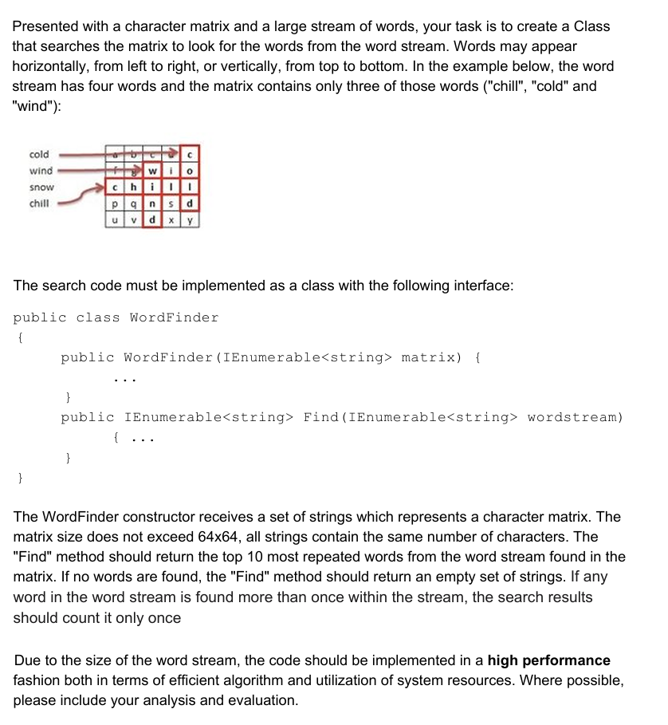

# WordFinderChallenge

Welcome to the WordFinderChallenge repository! This repo is intended to to solve the WordFinder Challenge as part of the Qu recruitment process

## Table of Contents

- [WordFinderChallenge](#wordfinderchallenge)
  - [Table of Contents](#table-of-contents)
  - [Problem](#problem)
  - [Thought Process](#thought-process)
  - [Algorithm Analysis](#algorithm-analysis)
  - [Assumptions and notes](#assumptions-and-notes)

## Problem



## Thought Process

My first approach to solving this was using a basic matrix traversal algorithm. The algorithm would be as follows:

    1) Convert the IEnumerable<string> matrix parameter on WordFinder constructor into a string[][] matrix
    2) On the Find method, run a foreach word in the wordstream parameter
    3) Traverse that matrix using 2 for statements. 
    4) For each position (x,y) check if the following characters horizontally (x + length of the word) or vertically (y + length of the word) starting in the current position match the word
    5) If yes, add 1 to the results dictionary where the key is the word we are searching and the value is the amount of times the word was found. 
    6) Sort the dictionary by the values descending and take the top 10. These are the top 10 most repeated words in the matrix. 

The problem with this approach is that we are traversing ALL of the positions in the matrix one by one and for each of those positions we traverse two arrays, the remaining characters in the column and in the row starting at the current position. 

An small optimization could be made to this approach where if we find the word in a given row, or column, we could skip the next X characters where X is the length of the word we are searching for because we know for sure that there won't be another instance of the word starting in the middle of the first instance. 

However, when implementing this algorithm, a second approach then occured to me. The approach consisted of instead of converting the input matrix list into an array, it occurred to me that I could treat both the rows and columns of the array as strings and then I can just traverse each value of the list to find the ocurrences a word has there, regardless of if it is a row or a column. This means getting the columns from the input and map them into strings. The algorithm is as follows:

    1) Instead of converting the matrix from the list of strings that represents each row, we extract the columns and save them along the original input as a list of strings (rowsAndColumns field). 
    2) On the find method, for each word in the wordstream parameter and item in the rowsAndColumns list, we check how many times that word appears in that item of the rowsAndColumns list (WordFinderHelper.CountWordOccurrences method)
    3) On that method, we start on the 0 index of the rowsAndColumns value and check if the next X characters match the input wordToFind where X is the length of it. If it matches, we get the index where that word starts. We add an ocurrence to the counter and move the index so that we skip this ocurrence.
    4) We do this until the IndexOf method returns -1 (not found) which happens once we get to the end of the line.
    5) Finally, back at the Find method, we sort the dictionary by the values descending and take the top 10, returning this as a result

I think that this approach, while in terms of strict algorithm analysis might not be superior (See Algorithm Analysis section) to my first one, it lead to a far better and cleaner code and easier to understand and mantain. In terms of memory storage, we leverage the format the input matrix is provided and we add to that instead of instancing a matrix. 

## Algorithm Analysis

In terms of time scalability, this solution is scales according to the list of strings provided. The array we can assume that since it won't be more than 64 by 64, the worst case scenario when transversing the rowsAndColumns list would be 128. This means O(1) constant time and space. 

Because of this, the big scalability determinant is going to be the list of words provided as an input because we doa foreach element in the words parameter list of the Find method. This is linear time, O(n) where n = length of the list provided. 

In regards to the result dictionary, I use it to store the ocurrences by using the word as key because it takes a constant time to set the value given the key. This later allows me to sort the dictionary by the value (ocurrences) and know which are the top 10 most repeated words. Its memory requirements will scale linearly with the size of the words input because for each value in that list, a key will be added to register the amount of ocurrences. 


## Assumptions and notes

 * This algorithm is highly parallelizable in order to process the list of values in the wordstream faster. The way I'd do it is by running in parallel different words in the wordstream list. The only thing we should be careful with is the results Dictionary. A ConcurrentDictionary should be used to provide thread-safe writing. The method would look like this: 

```c#
public IEnumerable<string> Find(IEnumerable<string> wordstream)
{
    var wordCounts = new ConcurrentDictionary<string, int>();

    Parallel.ForEach(wordstream, wordToFind =>
    {
        var occurrences = 0;
        foreach (var rowColumn in rowsAndColumns)
        {
            occurrences += WordFinderHelper.CountWordOccurrences(rowColumn, wordToFind);
        }

        wordCounts.AddOrUpdate(wordToFind, occurrences, (key, oldValue) => oldValue + occurrences);
    });

    return WordFinderHelper.GetTopTenWords(wordCounts.ToDictionary(kvp => kvp.Key, kvp => kvp.Value));
}

```
* I assumed the wordstream is a fixed size list of strings and not a proper stream. If it was a proper stream, I'd have used the Reactive Extensions library by leveraging the IObservable and IObserver interfaces. This is out of scope, but the use case would be if we write a small application that is subscribed to something like Kafka streams or something like that, we could provide the Find method with values as soon as they are streamed from the topic. 
* I assumed that both the wordstream collection and matrix would be validated by the client class, therefore I didn't include any validation code on the class itself. 
* I extracted some parts of the algorithm into the WordFinderHelper static class to make it easier to test and to write a code that is clearer on its intent as well. 